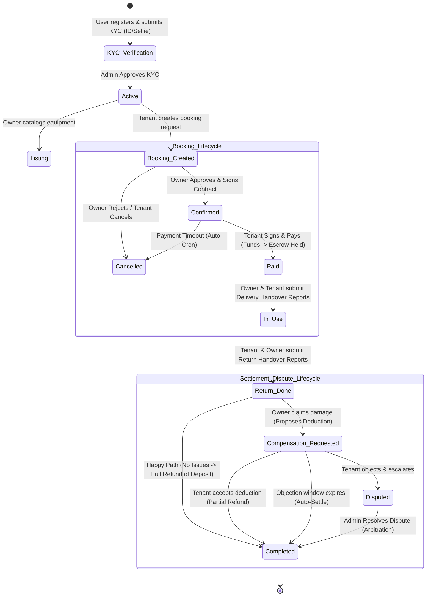

# Ejar: Premium Equipment Rental & Escrow Platform (منصة إيجار)

[](https://laravel.com)
[](https://reactjs.org)
[](https://tailwindcss.com)
[](https://inertiajs.com)
[](https://pestphp.com)

Ejar (إيجار) is a high-performance, enterprise-grade equipment rental and secure escrow platform tailored for the Yemeni market. The system connects equipment owners (lessors) with tenants (lessees) through a digitized contract lifecycle, multi-layered identity verification (KYC), double-party condition reporting, and automated financial escrow mechanisms to guarantee trust, transparency, and safety.

---

## Table of Contents

- [Overview](#overview)
- [System Architecture](#system-architecture)
- [Workflow & Lifecycle of a Rental](#workflow--lifecycle-of-a-rental)
- [Implemented Features](#implemented-features)
- [Database Schema](#database-schema)
- [Technology Stack](#technology-stack)
- [Project Structure](#project-structure)
- [Testing](#testing)

---

## Overview

In traditional equipment leasing, trust and security are major bottlenecks. Ejar solves these challenges by digitalizing the entire lifecycle of a rental transaction:
- **KYC Trust Protocol**: Mandatory government ID submission and facial selfie matching prevent fraud and verify identities before any catalog listing or booking occurs.
- **Escrow Financial Safety**: Rental and security deposits (insurance) are paid in advance and held in a secure virtual escrow account. Funds are released only after double-party consensus on delivery and return handovers.
- **Unified Disputes & Arbitration**: If equipment is damaged, lessors can propose deductions from the escrowed security deposit. Disagreements trigger an arbitration workflow resolved by platform administrators based on documented, photo-verified reports.
- **Regional Localization**: Configured specifically for Yemen, utilizing local currency configurations (Yemeni Rials) and supporting the 19 major governorates (Sana'a, Aden, Taiz, Hadramaut, etc.).

---

## System Architecture

Ejar is built on a robust hybrid design that combines **Laravel’s MVC paradigm** with **Domain-Driven Design (DDD)** principles and **Single-Responsibility Action Patterns**. The front end is fully integrated via **Inertia.js**, delivering a single-page application (SPA) experience powered by **React** and **Tailwind CSS v4**.

```
┌────────────────────────────────────────────────────────────────────────┐
│                              React View                                │
│                     (Inertia.js Client-Side SPA)                       │
└───────────────────────────────────┬────────────────────────────────────┘
                                    │ HTTP / JSON
                                    ▼
┌────────────────────────────────────────────────────────────────────────┐
│                           Controller Layer                             │
│                  (Slim Controllers / Route Guards)                     │
└───────────────────────────────────┬────────────────────────────────────┘
                                    │ DI (Dependency Injection)
                                    ▼
┌────────────────────────────────────────────────────────────────────────┐
│                             Domain Layer                               │
│  ┌───────────────────────────────┐  ┌───────────────────────────────┐  │
│  │       Workflow Services       │  │        Action Classes         │  │
│  │   (Orchestrators & Resolvers) │  │  (Single-Responsibility Use)  │  │
│  └───────────────────────────────┘  └───────────────────────────────┘  │
└───────────────────────────────────┬────────────────────────────────────┘
                                    │ Eloquent ORM
                                    ▼
┌────────────────────────────────────────────────────────────────────────┐
│                     Infrastructure & Database                          │
│               (MySQL / Escrow / Audit Log / Storage)                   │
└────────────────────────────────────────────────────────────────────────┘
```

### Architectural Patterns Implemented

1. **Domain-Driven Design (DDD) Modules**:
   The business logic is organized into domains under `app/Domains/`. Each domain contains its own:
   - **Enums**: Defines strict type systems and state models (e.g., `RentalStatus`, `PaymentStatus`, `KycStatus`).
   - **Services**: Orchestrates high-level business flows and coordinates state mutations (e.g., `RentalWorkflowService`, `PaymentWorkflowService`).
   - **Actions**: Executable single-purpose classes responsible for isolated write operations (e.g., `CreateContractAction`, `RefundInsuranceAction`).

2. **Thin Controllers & Form Requests**:
   Controllers under `app/Http/Controllers/` are kept minimal. They parse requests, authorize them using Policies, delegate execution to Domain Services, and return Inertia responses. HTTP validation is isolated in custom Form Requests (e.g., `StoreKycDocumentRequest`).

3. **Repository/State Resolver Pattern**:
   Instead of scattering state check conditions throughout the app, `RentalStateResolver` acts as a centralized validator, ensuring rental operations transition strictly according to platform constraints.

4. **Escrow & Virtual Ledger Pattern**:
   Virtual ledger transactions hold tenant rental fees and security deposits in escrow (`escrow_status = held`). The ledger is updated asynchronously based on milestones (delivery, return, compensation settlement, or admin arbitration).

5. **Polymorphic Auditing**:
   A centralized `AuditLogService` writes to the `audit_logs` table using Eloquent Polymorphic Relations (`target_type`, `target_id`). This tracks all administrative events, user activities, and financial mutations alongside execution metadata (IP addresses, active roles).

6. **Custom Middleware Guarding**:
   Custom HTTP route middleware controls execution streams:
   - `active`: Restricts access if a user account is suspended or banned.
   - `kyc`: Restricts specific transactional operations (e.g., booking, listing) to verified accounts.
   - `owner` / `tenant`: Validates role associations during request routing.

---

## Workflow & Lifecycle of a Rental

A complete transaction on Ejar executes through a state-controlled workflow:



### Steps in Detail:
1. **KYC & Onboarding**: A user signs up. Before renting out or booking equipment, they upload their ID documents and a facial selfie. Administrators review the submission, matching the ID to the photo, and toggle the user's `kyc_status` to `verified`.
2. **Cataloging & Inventory**: Verified owners create equipment listings. They define pricing, description, strict terms, location details, security deposits, and upload high-resolution photos.
3. **Reservation & Cart Validation**: Tenants browse, filter by category/city, select dates, and verify availability. In the checkout flow, the system dynamically calculates the price, maps the contract variables, and displays a digital lease agreement.
4. **Booking & Approval**: The tenant submits the booking, transitioning the rental record to `Pending`. The owner can approve or reject the booking. Upon owner approval, the rental transitions to `Confirmed`, locking the calendar dates and generating an owner-signed contract.
5. **Virtual Escrow Payment**: The tenant signs the contract and submits the payment details. The system confirms the payment, changes the rental state to `Paid`, and holds both the rental amount and security deposit in escrow. An automatic cron job checks for payment timeouts (default 24 hours) and cancels unpaid bookings.
6. **Double-Confirmation Delivery**: At the delivery site, the owner hands over the equipment and submits a delivery report with condition logs and photos. The tenant reviews the equipment and submits their delivery report. When both reports are confirmed, the status shifts to `InUse`, and the rental period officially commences.
7. **Return Handover**: At the end of the lease, the tenant returns the item and submits a return report with photos. The owner inspects the returned equipment and submits their return report, updating the state to `ReturnDone`.
8. **Deduction and Settle**:
   - **Happy Path**: If the equipment is returned in good condition, the owner releases the escrow. The rental fee is sent to the owner, and the full security deposit is refunded to the tenant. The rental status updates to `Completed`.
   - **Deduction Path**: If damages occurred, the owner proposes a deduction from the security deposit. The tenant has a set window (configurable in hours) to accept it. Acceptance payouts the owner for damages and refunds the remainder to the tenant.
   - **Dispute Path**: If the tenant disputes the deduction, a dispute ticket is generated. Admins review both parties' handover reports and photos, and make a final ruling (Accept, Reject, or Modify Compensation). Payouts are executed, and the status transitions to `Completed`.
9. **Review & Ratings**: Both parties can write reviews and submit ratings for the equipment and each other.

---

## Implemented Features

### 🔐 Authentication & Access Control
- **Multi-Guard Setup**: Decoupled authorization paths for standard users (`web`) and administration staff (`admin`).
- **KYC Verification System**: Verification uploads for National IDs, Passports, or Military IDs, including front/back cards and selfie pictures.
- **Account Suspension & Bans**: Admins can suspend or ban users, instantly revoking active sessions.
- **Interactive Role Guarding**: Middleware routes filtering based on user roles and account statuses.

### 🚜 Equipment Inventory & Availability
- **Catalog Management**: Creation, updating, dynamic visibility toggling, and soft deletion of listings.
- **Date Reservation System**: An engine checking blocked calendar blocks, preventing overlapping schedules.
- **Governorate Filtering**: Complete catalog filtering tailored for Yemen's 19 main governorates.
- **Multi-Image Processor**: Upload limits, sorting structures, and primary image definitions per equipment.

### 📝 Booking & Digital Contracting
- **Real-Time Booking Processing**: Calculates rent fees, security deposits, and final totals.
- **Digital Lease Agreements**: Electronic signing based on a platform contract template with variables (`contract_body`, `signatures`, `signed_at` timestamps).
- **Payment Countdown Enforcement**: Automatic cancellation of reservations if the payment is not completed within the platform's timeframe.

### 💳 Payment & Virtual Escrow
- **Escrow Accounting**: Separates rent and security deposits, holding them in locked virtual escrow.
- **Multiple Verification Paths**: Verification handles for manual bank transfers or digital wallets.
- **Admin Transaction Control**: Platform dashboard for reviewing, rejecting, approving, or refunding manual transactions.
- **Payout Distributions**: Transfers rental fees to owners (minus configured platform fees) and initiates refund tasks for tenants.

### 📋 Handover Reporting
- **Two-Phase Dual Reporting**: Decoupled reports for both delivery and return phases.
- **Condition Analysis & Logs**: Reports condition states (`good`, `damaged`, `partially_damaged`) with notes and visual proofs.
- **Verification Flow**: Forces mutual confirmation before changing rental states to active or returned.

### ⚖️ Compensation & Disputes
- **Deduction Proposal Tools**: Owners can claim damages and calculate late fees (calculated at 150% of the daily rate per late day).
- **Tenant Objection Window**: Configurable hours allowing tenants to accept or challenge proposed escrow deductions.
- **Admin Dispute Resolution**: Consolidated admin panel to review claims, inspect photos, and distribute escrowed funds.

### ⚙️ Platform Administration
- **Granular Admin Roles**: Support for `super_admin` (full permissions), `support` (user and review management), and `finance` (payment and dispute reviews).
- **Configurable Settings**: Dynamic edits of commission rates, payment windows, late fees, objection windows, and platform terms.
- **System-Wide Audit Trail**: Immutable logging of events, IP addresses, targets, and administrative actions.

---

## Database Schema

```
                  ┌──────────────────────┐         ┌──────────────────────┐
                  │        users         │         │     admin_roles      │
                  ├──────────────────────┤         ├──────────────────────┤
                  │ PK: id               │         │ PK: id               │
                  │ kyc_status           │         │ role_name (enum)     │
                  │ status (active...)   │         │ (permissions...)     │
                  └──────────┬───────────┘         └──────────┬───────────┘
                             │ 1                      1       │
                             │                                │ 1
    ┌────────────────────┐   │ 1..*                 1..*      │
    │   kyc_documents    ├───┤                     ┌──────────┴───────────┐
    ├────────────────────┤   │                     │       admins         │
    │ PK: id             │   │ 1                   ├──────────────────────┤
    │ FK: user_id ───────┼───┘                     │ PK: id               │
    │ doc_type, urls     │                         │ FK: role_id ─────────┘
    └────────────────────┘                         └──────────┬───────────┘
                                                              │ 1
    ┌────────────────────┐                         ┌──────────┴───────────┐
    │     categories     │                         │      audit_logs      │
    ├────────────────────┤                         ├──────────────────────┤
    │ PK: id             │                         │ PK: id               │
    │ parent_id, slug    │                         │ FK: admin_id ────────┘
    └──────────┬─────────┘                         │ polymorphic fields   │
               │ 1                                 └──────────────────────┘
               │
               │ 1..*
    ┌──────────┴─────────┐                         ┌──────────────────────┐
    │     equipment      │◄────────────────────────┤  user_pm_methods     │
    ├────────────────────┤ 1..*               1..* ├──────────────────────┤
    │ PK: id             │                         │ PK: id               │
    │ FK: owner_id ──────┼─────────┐       ┌───────┼─ FK: user_id         │
    │ FK: category_id    │         │       │       └──────────────────────┘
    └──────────┬─────────┘         │       │
               │ 1                 │       │
               │                   │ 1     │ 1
               │ 1..*              ▼       ▼
    ┌──────────┴─────────┐     ┌───┴───────┴──────┐
    │  equipment_images  │     │rental_operations │
    └────────────────────┘     ├──────────────────┤
                               │ PK: id           │
    ┌────────────────────┐     │ FK: tenant_id ───┼───────┐
    │equipment_availabil.│     │ FK: owner_id     │       │
    ├────────────────────┤     │ FK: equipment_id │       │
    │ PK: id             │     └──────────┬───────┘       │
    │ FK: equipment_id ──┘                │ 1             │
    └────────────────────┘                │               │ 1
                                          │ 1             │
    ┌────────────────────┐       ┌────────┴────────┐      │ 1..*
    │     contracts      │◄──────┤equipment_handov.│      │
    ├────────────────────┤ 1   1 ├─────────────────┤      │
    │ PK: id             │       │ PK: id          │      │
    │ FK: rental_op_id ──┘       │ FK: rental_op_id│      │
    └────────────────────┘       └────────┬────────┘      │
                                          │ 1             │
                                          │               │
                                          │ 1             │
    ┌────────────────────┐       ┌────────┴────────┐      │
    │      disputes      │◄──────┤handover_reports │      │
    ├────────────────────┤ 1   1 ├─────────────────┤      │
    │ PK: id             │       │ PK: id          │      │
    │ FK: rental_op_id   │       │ FK: rental_op_id│      │
    │ FK: handover_id ───┘       └────────┬────────┘      │
    └────────────────────┘                │ 1             │
                                          │               │
                                          │ 1..*          │
                                 ┌────────┴────────┐      │
                                 │ handover_images │      │
                                 └─────────────────┘      │
                                                          ▼
                                                 ┌────────────────┐
                                                 │    payments    │
                                                 ├────────────────┤
                                                 │ PK: id         │
                                                 │ FK: rental_op_id
                                                 │ FK: payer_id   │
                                                 └────────────────┘
```

### Table Definitions:
- **`users`**: Contains account states, profile data, location governorates, and user-facing averages.
- **`kyc_documents`**: Stores submitted government documents, image paths, selfie URLs, and review notes.
- **`user_payment_methods`**: Keeps default accounts and verified banks or e-wallets.
- **`admin_roles` & `admins`**: System personnel, statuses, and granular authorization grids.
- **`platform_settings`**: Global parameters (rates, times, limits).
- **`audit_logs`**: Immutable ledger of administrative and functional modifications.
- **`categories`**: Tree of equipment catalogs.
- **`equipment`**: Store profiles of the assets, daily price, insurance deposit, and owner mapping.
- **`equipment_images`**: High-resolution image files linked to equipment.
- **`equipment_availability`**: Date blocks reserved or manually blocked.
- **`rental_operations`**: Core booking records with amounts, states, timeline timestamps, and routing parameters.
- **`contracts`**: Markdown lease agreement copies with signature states.
- **`payments`**: Payment transaction logs, statuses, references, and escrow tracking.
- **`handover_reports`**: Mutual handover reports storing condition parameters, notes, and reporter metadata.
- **`handover_images`**: Handover evidence images.
- **`equipment_handover`**: Post-rental parameters, actual return dates, late fees, proposed deductions, and decision paths.
- **`disputes`**: Dispute tickets showing tenant claims, admin notes, decisions, and resolutions.
- **`reviews`**: Ratings and feedback mapped to users or equipment.
- **`notifications`**: Targeted messages sent to users or administrators.

---

## Technology Stack

- **Programming Languages**: PHP 8.2+, JavaScript (ES6+), SQL, CSS
- **Backend Framework**: Laravel 11.0 (Core Engine)
- **Frontend Connector**: Inertia.js 2.0 (Single-Page App Bridge)
- **UI & CSS Framework**: React 18.2 with Tailwind CSS v4 and Material UI (MUI v7) / Radix UI Primitives
- **Database Engine**: MySQL 8.0+
- **Database ORM**: Eloquent ORM
- **Authentication Method**: Laravel Session Guards (`web` & `admin` Guards)
- **Routing & Path Sharing**: Tightenco/Ziggy (shares Laravel routing names with React)
- **Interactive Libraries**:
  - *Charts*: Recharts (admin metrics & dashboards)
  - *Animations*: Motion / Tw Animate CSS
  - *Date handling*: Date-fns
  - *Carousel components*: Embla Carousel / Slick React
  - *Notifications (Toasts)*: Sonner
- **Testing Engine**: Pest PHP (Feature & Unit testing)
- **Vite compilation**: Vite 5.0+

---

## Project Structure

The project follows a hybrid design combining modular domains with standard Laravel application structures:

```text
ERP/
├── app/
│   ├── Domains/               # Domain-Driven Business Modules
│   │   ├── Admin/             # Admin Authentication & Roles
│   │   ├── Compensation/      # Return Valuations & Deposit Settle
│   │   ├── Dispute/           # Claim Arbitration & Admin Decisions
│   │   ├── Equipment/         # Catalog & Availability logic
│   │   ├── Handover/          # Delivery & Return Reports
│   │   ├── Payment/           # Escrow Holdings & Transactions
│   │   ├── Rental/            # Booking Operations & Agreements
│   │   ├── Review/            # Ratings & Feedback System
│   │   ├── Shared/            # Shared Exceptions & Enums
│   │   └── User/              # Client Settings & KYC Workflows
│   ├── Http/
│   │   ├── Controllers/       # Thin Controllers (maps HTTP requests)
│   │   │   └── Admin/         # Admin Management Controllers
│   │   ├── Middleware/        # Route Filters (KYC checks, role guards)
│   │   └── Requests/          # Custom Form Request Validations
│   ├── Models/                # Eloquent Database Models
│   ├── Policies/              # Security Authorization Policies
│   ├── Providers/             # Service Providers (App registrations)
│   ├── Shared/                # Cross-domain services (Audit, Notify, Settings)
│   └── Support/               # Helpers and presenting handlers
├── bootstrap/
│   └── app.php                # Middleware Registry & Routing Entry
├── config/                    # System Configurations (auth, locations, etc.)
├── database/
│   ├── factories/             # Database Model Factories
│   ├── migrations/            # Table Schemas
│   └── seeders/               # Base Seed Data (Admin, categories, users)
├── public/                    # Build outputs & client static files
├── resources/
│   ├── css/                   # Stylesheets (admin, fonts, index)
│   ├── js/                    # React SPA components
│   │   ├── Admin/             # Admin Dashboard Components
│   │   ├── Components/        # Shared UI Primitives
│   │   ├── Layouts/           # Navigation & Layout templates
│   │   ├── Pages/             # Inertia Page Components
│   │   └── features/          # Portal Pages (home, cart, details)
│   └── views/                 # Blade templates (Inertia root template)
├── routes/
│   ├── auth.php               # Front authentication paths
│   ├── console.php            # Console commands definitions
│   └── web.php                # Unified application web routing
├── tests/
│   ├── Feature/               # pest feature test suites
│   ├── Unit/                  # pest unit test cases
│   └── Pest.php               # pest test configurations
├── package.json               # Node dependencies & frontend scripts
├── composer.json              # PHP dependencies & composer scripts
├── tailwind.config.js         # Tailwind configuration
└── vite.config.js             # Vite building configuration
```

---

## Testing

Ejar uses the **Pest PHP** testing framework for unit and integration tests, ensuring all core rental and payment states transition correctly.

To run the automated tests, execute:

```bash
php artisan test
```

### Key Integration Tests:
- **`RentalWorkflowTest`**: Validates the happy path workflow (Booking $\rightarrow$ Confirm $\rightarrow$ Pay $\rightarrow$ Delivery Handover $\rightarrow$ Return Handover $\rightarrow$ Completion) and guards against double payments and illegal state transitions.
